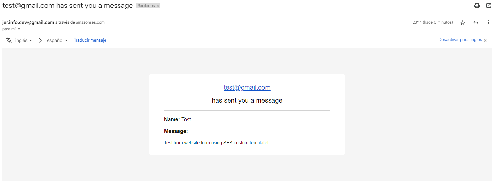

# AWS Lambda Url - SES Demo

This demo provides an overview of two AWS Lambda functions that use the AWS SDK for JavaScript (v3) to send emails using Amazon SES (Simple Email Service). Each function demonstrates a different approach to sending emails: one using HTML and Text formats, and the other using custom email templates.

> There is a sample React form component in this repository called `ContactForm.jsx`.



## ses_html_text_demo - Send Email (HTML and Text Formats)

### Function Overview

This AWS Lambda function sends emails via Amazon SES in both HTML and Text formats. It receives an event object containing email details (recipient, sender, name, message). 

The function then constructs and sends an email using the provided information.

### Prerequisites

Before using this Lambda function, make sure you have the following prerequisites in place:

1. An AWS account.
2. Amazon SES configured with appropriate permissions and verified email addresses.
3. AWS Lambda function created and configured with the necessary permissions to send emails through SES.

### Configuration

Before deploying this Lambda function, ensure that you've replaced the following placeholders in the code:

- `<YOUR_REGION>`: Replace this with the AWS Region you're using for Amazon SES.
- `<TO_EMAIL>`: Replace this with the recipient's email address.
- `<FROM_EMAIL>`: Replace this with the sender's email address (must be verified in Amazon SES).

### Usage

1. Deploy the Lambda function in your AWS account.
2. Set up a trigger source (e.g., API Gateway) to invoke the Lambda function and pass the required event data (email, name, message).
3. When triggered, the Lambda function will send an email with the provided details to the specified recipient.

## ses_template_demo - Send Email Using Templates

### Function Overview

This AWS Lambda function demonstrates sending emails via Amazon SES using email templates. 

The function then sends an email using a predefined email template, populating it with the provided data.

### Custom Email Templates with mjml and Escaping HTML

This Lambda function uses custom email templates created with [mjml](https://mjml.io/).

### Escaping HTML Template from mjml with [freeformatter](https://www.freeformatter.com/json-escape.html) 

The mjml template is escaped with https://www.freeformatter.com/json-escape.html and then pasted into the `SES_TemplateDemo.json` file.

#### Command to create template:

```bash
aws ses create-template --cli-input-json file://SES_TemplateDemo.json
```

#### Command to update template:

```bash
aws ses update-template --cli-input-json file://SES_TemplateDemo.json
```

### Troubleshooting

If you encounter any issues or errors while using this Lambda function, check the following:

- Ensure that your AWS credentials and permissions are correctly configured.
- Verify that Amazon SES is properly set up, and your email addresses are verified.
- Check the CloudWatch Logs for the Lambda function for detailed error information.

For more information and troubleshooting tips, refer to the AWS documentation for Amazon SES and AWS Lambda.

